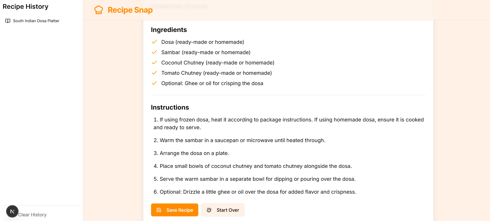

# Recipe Snap 📸

**Live Demo:** [**https://recipe-snapp.netlify.app/**](https://recipe-snapp.netlify.app/)

Recipe Snap is a web application that helps you discover new recipes based on the ingredients you have on hand. Simply snap a photo of your ingredients, and our AI-powered assistant will identify them and suggest delicious recipes you can make.

## Screenshots

| Upload Image | Ingredient Upload | Recipe View |
| :---: | :---: | :---: |
|  |  |  |

## ✨ Features

- **Photo-to-Ingredients:** Upload a photo, and the app will use generative AI to identify the ingredients.
- **Ingredient Editing:** Easily add or remove ingredients from the identified list before generating a recipe.
- **AI Recipe Generation:** Get a complete recipe, including name, ingredients, step-by-step instructions, and estimated cooking time.
- **Recipe History:** Save your favorite generated recipes to your browser's local storage for easy access later.

## 🛠️ Tech Stack

This project is built with a modern, full-stack TypeScript setup:

- **Framework:** [Next.js](https://nextjs.org/) (with App Router)
- **UI:** [React](https://react.dev/)
- **Styling:** [Tailwind CSS](https://tailwindcss.com/)
- **Components:** [ShadCN UI](https://ui.shadcn.com/)
- **AI/Generative:** [Genkit](https://firebase.google.com/docs/genkit)
- **Language:** [TypeScript](https://www.typescriptlang.org/)

## 🚀 Running Locally

To run this project on your local machine, follow these steps:

1.  **Clone the Repository:**
    ```bash
    git clone https://github.com/tabarakmukhtar/Recipe-Snap.git
    cd Recipe-Snap
    ```

2.  **Install Dependencies:**
    ```bash
    npm install
    ```

3.  **Set up Environment Variables:**
    Create a file named `.env` in the root of your project and add your Gemini API key:
    ```
    GEMINI_API_KEY=your_api_key_here
    ```

4.  **Run the Development Servers:**
    This single command will start both the Next.js frontend and the Genkit AI backend concurrently:
    ```bash
    npm run genkit:dev
    ```

5.  **Open the App:**
    Your application should now be running at [http://localhost:3000](http://localhost:3000).

## 🌐 Deployment

This application is configured for easy deployment to [Netlify](https://www.netlify.com/).

1.  **Connect Your Repo to Netlify:** Import your GitHub repository into Netlify.
2.  **Configure Build Settings:** The `netlify.toml` file in this repository pre-configures the build settings. Netlify should automatically detect and use them.
3.  **Set Environment Variable:** This is the most important step. In your Netlify site settings, go to `Build & deploy` > `Environment` and add your `GEMINI_API_KEY`. The AI features will not work without it.
4.  **Deploy:** Trigger a new deployment. Your site will be live in a few minutes.

## 📄 License

This project is licensed under the MIT License. See the [LICENSE](LICENSE) file for details.
